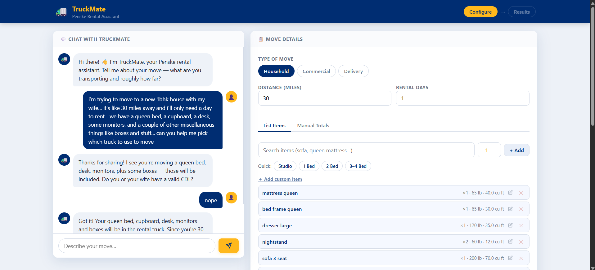
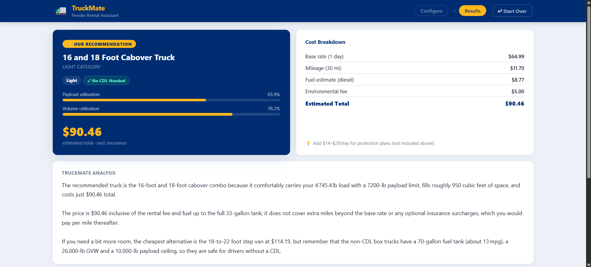
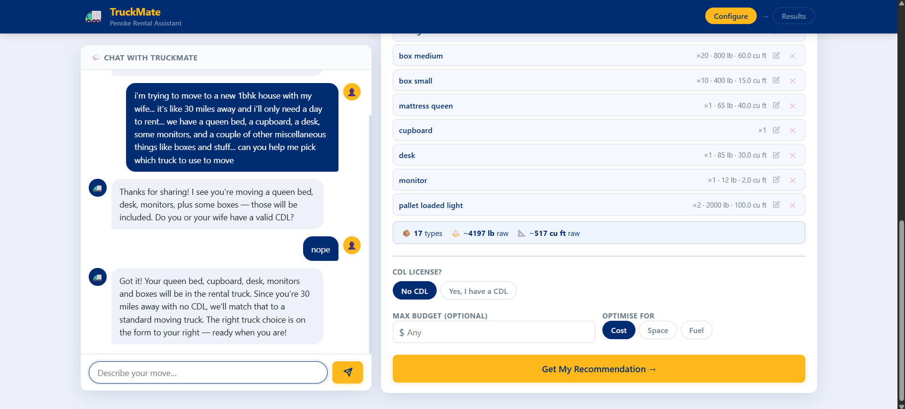
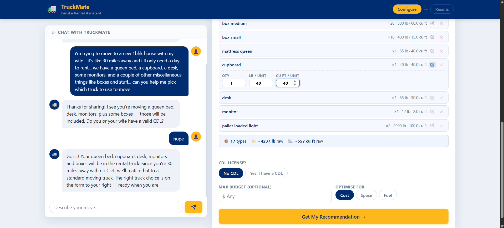

# TruckMate — Penske Truck Rental Assistant

An AI-powered chatbot that helps customers find the right Penske truck for their move or delivery. Built as a proof-of-concept for an AI/ML engineering internship, demonstrating agentic AI, RAG (Retrieval-Augmented Generation), LLM provider switching, and a clean split-panel web interface.

---

## Screenshots

> Add your screenshots to a `docs/screenshots/` folder and update the paths below.

| Workspace (split-panel) | Results |
|---|---|
|  |  |

**Autocomplete item search**


**Inline item editing (pencil icon)**


---

## What It Does

The app runs as a single-page split-panel interface:

- **Left panel — Chat:** TruckMate greets the user and asks about their move. As the user types, the agent extracts structured data (distance, days, items mentioned, CDL status, etc.) and **automatically fills the right-hand form** with a gold pulse animation.
- **Right panel — Move Details:** Always visible. The user can fill it in manually, let the chat auto-populate it, or mix both. Contains move type, distance/days, a cargo section (item list or manual weight/volume), CDL toggle, budget, and priority.
- **Results view:** Full-width page showing the recommended truck with utilization bars, a cost breakdown table, alternative options, AI-generated explanation, warnings, and relevant policy notes.

### Cargo entry options

1. **Search & add** — Themed autocomplete searches 78+ items by name or alias (e.g. "queen bed" → `mattress_queen`). Supports keyboard navigation.
2. **Quick presets** — One-click cargo templates for Studio, 1 Bed, 2 Bed, and 3–4 Bed moves.
3. **Inline edit** — Click the pencil icon on any item row to expand and override quantity, weight, and volume without changing the database defaults. The meta line and running summary update live.
4. **Custom items** — "＋ Add custom item" expands a form to enter any item name with custom qty, lb/unit, and cu ft/unit — for things like pianos, hot tubs, or specialty equipment not in the database.
5. **Manual totals** — Enter raw total weight and volume directly (Manual Totals tab).

---

## Architecture

```
User Browser
     │
     ▼
FastAPI (backend/main.py)          ← serves frontend + API routes
     │
     ├── /api/chat  ──────────────► agent.py
     │                               ├── chat()            conversational response
     │                               └── extract_form_data() structured JSON → auto-fills form
     │                               │
     │                               └── _llm() dispatcher
     │                                    ├── _call_ollama()   local model via Ollama
     │                                    └── _call_gemini()   Google Gemini API
     │
     └── /api/recommend
              │
              ├── tools.py          ← deterministic pipeline (no LLM)
              │    ├── lookup_object()       item DB lookup with alias matching
              │    ├── calculate_load()      weights + volumes + safety margins
              │    ├── filter_trucks()       payload / volume / CDL constraints
              │    ├── rank_trucks()         cost estimates, utilisation metrics
              │    └── estimate_cost()       base + mileage + fuel + env fee
              │
              ├── rag.py            ← ChromaDB vector search (always local)
              │    └── search()     retrieves relevant policy/spec chunks
              │
              └── agent.py         ← LLM (Ollama or Gemini, per .env)
                   └── generate_recommendation()  3-paragraph prose explanation
```

**Key design decisions:**

- **Deterministic first, LLM last.** All filtering, ranking, and cost math is done in pure Python. The LLM only handles conversational chat and writing the final explanation. The recommendation is always factually grounded — the LLM cannot hallucinate a truck spec or cost figure.
- **Dual LLM calls per chat message.** Each user message triggers two LLM calls: one for the conversational reply, and one focused extraction call (temperature=0) that returns structured JSON to auto-fill the form fields.
- **Switchable LLM provider.** Set `LLM_PROVIDER=ollama` or `LLM_PROVIDER=gemini` in `.env` to switch at runtime. RAG embeddings always run locally regardless of provider.
- **ChromaDB for RAG.** Policy documents and truck specs are indexed as vector embeddings at startup. Relevant chunks are retrieved and passed to the LLM alongside computed results.

---

## Project Structure

```
truck_rental_assistant/
│
├── data/
│   ├── truck_data.json          # 7 Penske light/medium trucks with specs + CDL flags
│   ├── cost_profiles.json       # Estimated daily/weekly/monthly rates, mileage rates,
│   │                            # insurance options, fuel reference, discount programs
│   ├── common_objects.json      # 78 household/commercial items across 10 categories,
│   │                            # each with weight (lb), volume (cu ft), and aliases
│   └── policy_docs/
│       ├── rental_policy.txt
│       ├── cdl_requirements.txt
│       ├── fuel_policy.txt
│       ├── loading_guidelines.txt
│       ├── mileage_policy.txt
│       └── insurance_options.txt
│
├── backend/
│   ├── config.py     # Loads .env — paths, provider, model names, packing constants
│   ├── rag.py        # ChromaDB setup, document indexing, semantic search
│   ├── tools.py      # Pure-Python pipeline: item lookup, load calc, filter, rank, cost
│   ├── agent.py      # LLM dispatcher (Ollama / Gemini), chat, extraction, recommendation
│   └── main.py       # FastAPI app, all API routes, serves frontend static files
│
├── frontend/
│   ├── index.html              # Single-page split-panel app
│   └── static/
│       ├── css/style.css       # Navy/gold design system, autocomplete, item rows,
│       │                       # autofill pulse animation, results cards
│       └── js/app.js           # Chat, form auto-fill, themed autocomplete,
│                               # inline item editing, custom item adder,
│                               # preset cargo lists, results rendering
│
├── .env                        # Local config (not committed — contains API keys)
├── .env.example                # Template — copy to .env and fill in
├── .gitignore
├── requirements.txt
├── truck_data.xlsx             # Original source data (raw Penske truck specs)
└── .claude/
    └── launch.json             # Dev server config for Claude Code preview
```

---

## Setup

### Prerequisites

- Python 3.11+
- For local models: [Ollama](https://ollama.com) installed and running
- For Gemini: a Google AI Studio API key

### 1. Install dependencies

```bash
pip install -r requirements.txt
```

The first run also downloads the `all-MiniLM-L6-v2` sentence-transformer model (~80 MB) used for RAG embeddings. This is cached automatically.

### 2. Configure your `.env`

Copy the template and fill in your settings:

```bash
cp .env.example .env
```

Edit `.env`:

```env
# Choose your LLM provider: "ollama" or "gemini"
LLM_PROVIDER=ollama

# Ollama settings (used when LLM_PROVIDER=ollama)
OLLAMA_MODEL=gemma4:latest
OLLAMA_BASE_URL=http://localhost:11434

# Gemini settings (used when LLM_PROVIDER=gemini)
GEMINI_API_KEY=your_key_here
GEMINI_MODEL=gemma-3-27b-it
```

### 3. Pull a local model (if using Ollama)

```bash
# High quality (9.6 GB)
ollama pull gemma4:latest

# Lighter/faster (2.8 GB)
ollama pull hf.co/nvidia/NVIDIA-Nemotron-3-Nano-4B-GGUF:Q4_K_M
```

### 4. Start the server

```bash
python -m uvicorn backend.main:app --reload --port 8000
```

On first startup, the server indexes all policy documents and truck data into ChromaDB:

```
[Startup] Initialising knowledge base...
[RAG] Indexed 31 chunks into knowledge base.
[Startup] Ready.
```

Subsequent starts skip indexing (idempotent). Open **http://localhost:8000**.

---

## Configuration Reference

All settings are controlled via `.env`. No code edits needed to switch models or providers.

| Variable | Default | Description |
|---|---|---|
| `LLM_PROVIDER` | `ollama` | `"ollama"` or `"gemini"` |
| `OLLAMA_MODEL` | `gemma4:latest` | Any model name shown in `ollama list` |
| `OLLAMA_BASE_URL` | `http://localhost:11434` | Ollama server URL |
| `GEMINI_API_KEY` | — | Get one at [aistudio.google.com](https://aistudio.google.com/app/apikey) |
| `GEMINI_MODEL` | `gemma-3-27b-it` | Any Gemini model ID (e.g. `gemini-2.5-pro`, `gemini-2.0-flash`) |

> **RAG embeddings** (`all-MiniLM-L6-v2`) always run locally regardless of which LLM provider is selected.

**To rebuild the RAG index** after editing policy docs:

```bash
curl -X POST http://localhost:8000/api/rag/reset
```

---

## API Reference

Interactive docs available at `http://localhost:8000/docs`.

| Method | Endpoint | Description |
|---|---|---|
| `GET` | `/` | Serves the frontend |
| `GET` | `/api/health` | Health check + active LLM provider |
| `GET` | `/api/trucks` | All truck specs |
| `GET` | `/api/objects` | Full item database (78 items, 10 categories) |
| `GET` | `/api/costs` | Cost profiles and rate structures |
| `GET` | `/api/rag/search?q=<query>&n=<n>` | Search knowledge base directly |
| `POST` | `/api/rag/reset` | Delete and rebuild the ChromaDB index |
| `POST` | `/api/chat` | Conversational chat + form field extraction |
| `POST` | `/api/recommend` | Full recommendation pipeline |

### `/api/chat` — request / response

```json
// Request
{ "messages": [{"role": "user", "content": "Moving a 2-bed apartment 150 miles"}] }

// Response
{
  "response": "Got it! 150 miles for a 2-bedroom move...",
  "extracted_data": {
    "room_hint": "2bed",
    "distance_miles": 150
  }
}
```

`extracted_data` is mapped directly to the form fields and triggers the autofill animation.

### `/api/recommend` — request body

```json
{
  "move_type": "household",
  "distance_miles": 150,
  "rental_days": 1,
  "has_cdl": false,
  "priority": "cost",
  "max_budget_usd": null,
  "items": [
    {"name": "mattress_queen", "quantity": 1, "weight_lb": 90, "volume_cuft": 40},
    {"name": "sofa_3_seat",    "quantity": 1, "weight_lb": 200, "volume_cuft": 70},
    {"name": "box_medium",     "quantity": 20, "weight_lb": 30, "volume_cuft": 3}
  ]
}
```

`priority` accepts `"cost"` | `"space"` | `"fuel_efficiency"`. Instead of `items`, pass `custom_total_weight_lb` and/or `custom_total_volume_cuft` for manual override.

---

## Trucks in the Fleet

| Truck | Space (cu ft) | Payload (lb) | CDL |
|---|---|---|---|
| 12 Foot Box Truck | 450 | 3,100 | No |
| 16 Foot Box Truck | 800 | 4,300 | No |
| Delivery Truck With Shelves | 800 | 3,800 | No |
| 16–18 Foot Cabover Truck | 950 | 7,200 | No |
| 18–22 Foot Step Van | 1,000+ | 10,000 | No |
| 22–26 Foot Box Truck (Non-CDL) | 1,700 | 10,000 | No |
| 22–26 Foot Box Truck (CDL) | 1,700 | 17,000 | **Yes** |

All trucks use diesel fuel. Costs are estimates based on publicly available Penske rate ranges.

---

## Recommendation Pipeline

1. **Item lookup** — Each item is matched to `common_objects.json` by key or alias with normalized matching (underscores ↔ spaces). Unknown items use the user-supplied weight/volume, or are flagged in warnings if neither is available.

2. **Load calculation** — Raw totals get a **12% weight safety buffer** and are divided by **0.75 packing efficiency** for volume, giving the minimum truck specs required.

3. **Truck filtering** — Hard constraints: payload capacity, loading space, and CDL requirement.

4. **Ranking** — Filtered trucks are sorted by the user's priority. Cost estimates include base rate × days + per-mile × miles + diesel fuel + environmental fee. Insurance is excluded and noted separately.

5. **RAG retrieval** — A query built from the move context is run against ChromaDB (cosine similarity) to pull the most relevant policy and spec chunks.

6. **LLM explanation** — All computed data is passed to the configured LLM, which writes a 3-paragraph plain-English recommendation. If the LLM is unavailable, a structured fallback is returned.

---

## Notes for Stakeholders

- **All pricing is estimated** from publicly available Penske rate information. Actual rates vary by location, season, and availability. A production version would pull live rates from a pricing API.
- **Local models via Ollama** mean no customer data is sent to any external service. Switching to Gemini requires an API key and sends prompts to Google's servers.
- **The RAG knowledge base** is built from files in `data/policy_docs/`. Updating a policy doc and calling `/api/rag/reset` is all that's needed to reflect new policy information.
- **The item database** covers 78 common household and commercial items. Unknown items can be entered with custom weight and volume via the "Add custom item" form — those values flow directly into the load calculation.
